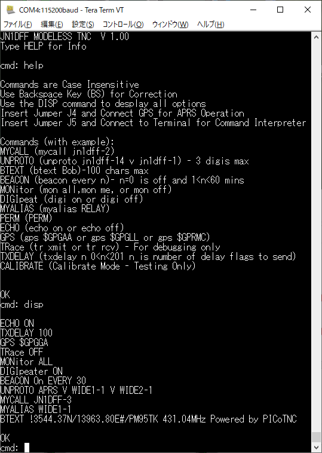
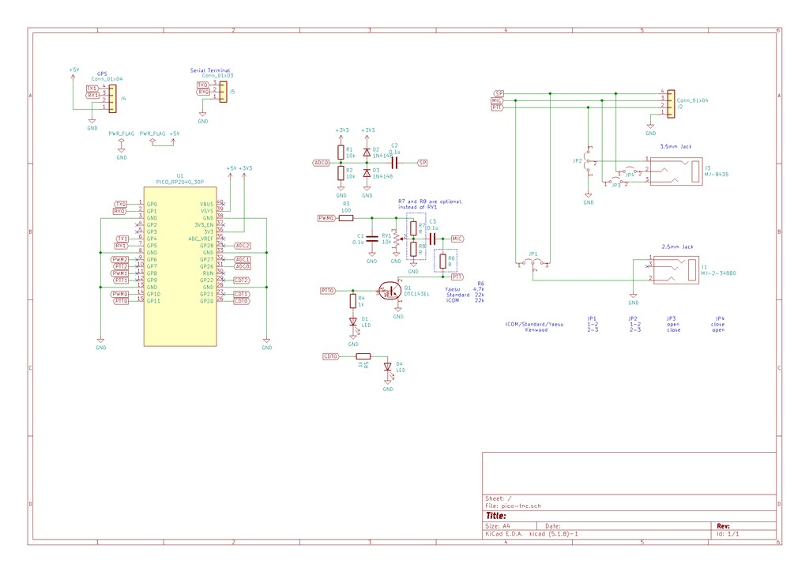

# PICO TNC

PICO TNC is the Terminal Node Controler for Amateur Packet Radio powered by Raspberry Pi Pico.

This TNC has same functionality as WB8WGA's PIC TNC.

## PIC TNC features

- Digipeat UI packet up to 1024 byte length
- Send beacon packet
- Support converse mode
- Support GPS tracker feature
- Support both USB serial and UART serial interface

## Additional features

- Support KISS mode
- Support multi-port up to 3 ports

## How to build

```
cd pico_tnc
mkdir build
cd build
cmake ..
make -j4
```


[](schematic.png)
