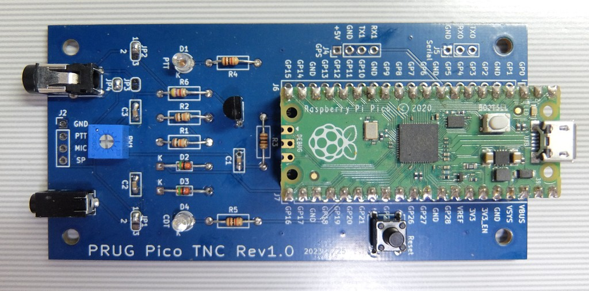
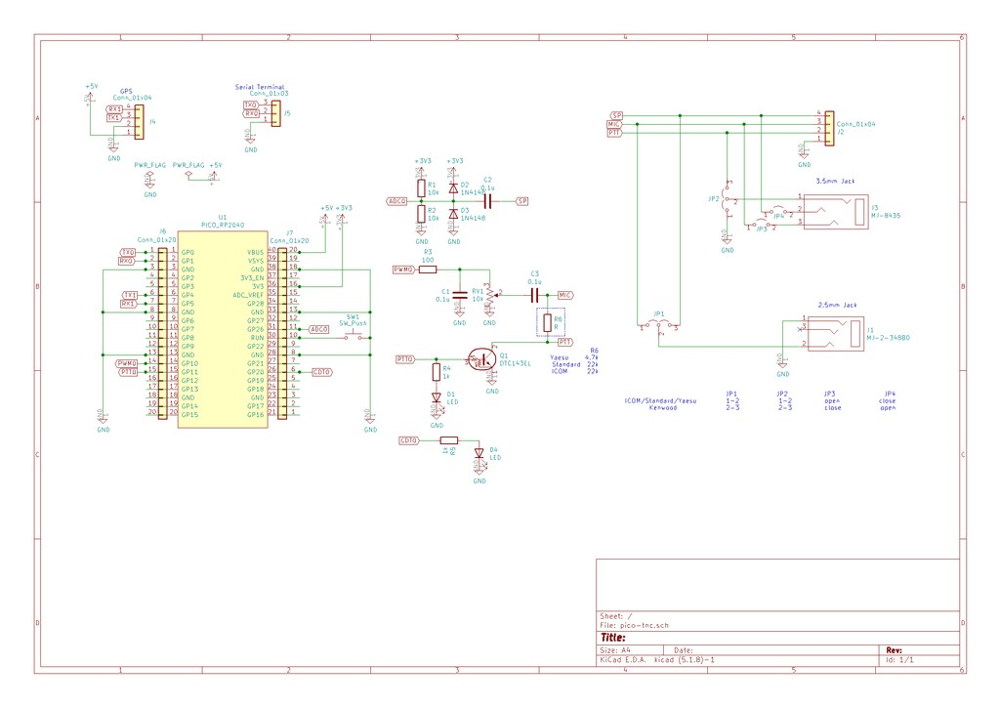
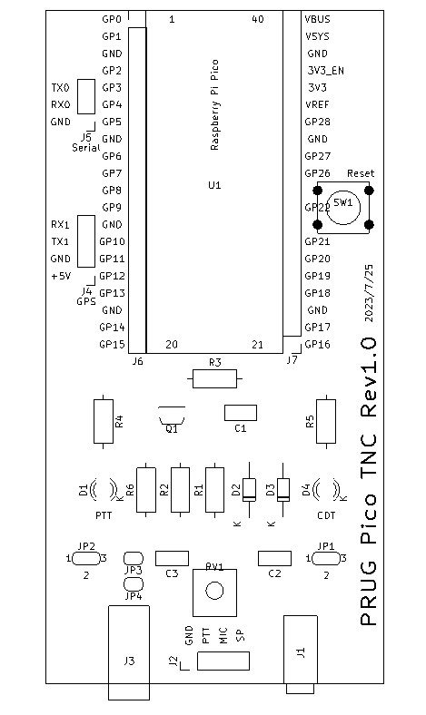

# PICO TNC

PICO TNCはRaspberry Pi Picoを使ったTNC(ターミナルノードコントローラー)です．

# 特長

* WB8WGA PICTNCとほぼ同等の機能
* Bell 202 1200bps AFSKの送信と受信
* AX.25のUIフレームの送信
* 定期的なBEACONの送信
* UI-DIGIの機能
* KISSプロトコルをサポート

# 回路図

# 部品リスト

|記号|値|品名|備考|
|---|:---:|---|---|
|U1||Raspberry Pi Pico||
|Q1||DTC143EL|デジタルトランジスタ||
|R1,R2|10k|抵抗|
|R3|100|抵抗|
|R4,R5|1k|抵抗|
|R6|4.7k/22k|抵抗|YESU 4.7k,ICOM/STANDARD 22k|
|D2,D3|1N4148|ダイオード|
|D1|赤|LED|
|D4|緑|LED|
|C1,C2,C3|0.1uF|コンデンサ|
|VR1|10k|半固定抵抗|Bourns 3362P|
|以下オプション|||
|J1||2.5mm Jack|マル信電機MJ-2-34B0|
|J3||3.5mm Jack|マル信電機MJ-8435|
|SW1||スイッチ|秋月P-03647|

# シルク図(部品面)

# ハンダジャンパの設定

J1,J3を使う場合のみ必要．J2の端子から無線機に接続する場合は必要なし．

||JP1|JP2|JP3|JP4|
|---|:---:|---|---|---|
|ICOM/STANDARD/YAESU|1-2|1-2|オープン|ショート|
|KENWOOD|2-3|2-3|ショート|オープン|

# ファームウェアの書き込み

をRaspberry Pi Picoに書き込む．(ドラッグ・アンド・ドロップ)

# コマンドリスト(設定例)

|コマンド|設定例|説明|
|---|:---:|---|
|MYCALL|mycall jn1dff-2|コールサインの設定|
|UNPROTO|unproto jn1dff-1 v jn1dff-1|送信先，デジピーターの指定，デジピーターは3つまで|
|CON|con|コンバースモードへ移行，CRで入力した文字列がUIフレームとしてUNPROTOの設定先に送信される，Ctrl-Cで終了|
|BTEXT|btext this is beacon|ビーコンで送信するテキストの設定，最大100バイト|
|BEACON|beacon every n|ビーコンの送信間隔を分で指定，n=0でオフ，設定範囲は1～59分|
|MONitor|mon all, mon me, mon off|モニターするするパケットの指定，all 全て，me 自局宛のみ，off モニターしない|
|MYALIAS|myalias RELAY|エイリアスの指定，指定されたコールサインでデジピーターとして動作する|
|PERM|perm|設定を不揮発性メモリに保存する|
|DISP|disp|設定値の表示|
|ECHO|echo on, echo off|シリアル入力のエコーバックの設定，on 表示する，off 表示しない|
|GPS|gps $GPGAA, gps $GPGLL, gps $GPRMC|GPSのどのメッセージを送信するかの設定，それぞれの$GPSメッセージを送信|
|TXDELAY|txdelay n|PTTをオンにしてからパケットを送信するまでの待ち時間，待ち時間はn/150秒|
|CALIBRATE|calibrate|テスト用のトーンを送信する，スペースでトーンの切り替え，Ctrl-Cで終了|
|KISS|kiss on, kiss off|KISSモードのオン，オフ|

# シリアル出力例

